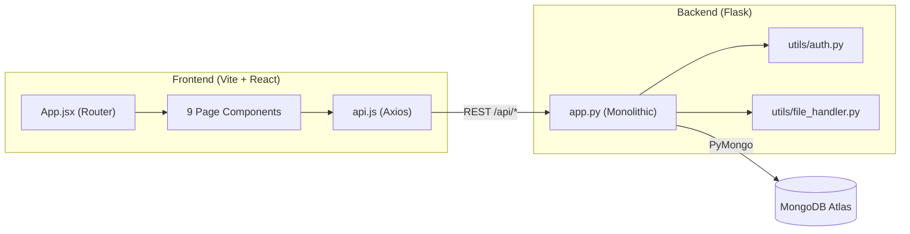

# Foster Care Management System (FCMS) — Project Walkthrough

A full-stack web application for managing orphaned children, foster families, donations, and child welfare agencies in Bangladesh. Built for **CSE411**.

---

## Tech Stack

| Layer | Technology |
|-------|-----------|
| Backend | **Flask 3.x** (Python), PyMongo, JWT (PyJWT), bcrypt |
| Database | **MongoDB Atlas** (NoSQL, `fosterdb` database) |
| Frontend | **React 18** + Vite, React Router v6, Axios, Lucide icons |
| Styling | Vanilla CSS with design tokens (Poppins + Inter fonts) |

---

## Architecture Overview

---

## Backend Structure

All 999 lines of backend logic live in a single [app.py](file:///home/rafi/Workspace/Projects/cse411/foster_care/backend/app.py). The `routes/` directory is **empty** — routes were never modularized.

### Key Files

| File | Purpose |
|------|---------|
| [app.py](file:///home/rafi/Workspace/Projects/cse411/foster_care/backend/app.py) | All Flask routes (auth, CRUD for 7 collections, file upload, stats, health check) |
| [config.py](file:///home/rafi/Workspace/Projects/cse411/foster_care/backend/config.py) | Env config: Mongo URI, JWT secret, upload settings |
| [database.py](file:///home/rafi/Workspace/Projects/cse411/foster_care/backend/database.py) | MongoDB connection via PyMongo ([init_db](file:///home/rafi/Workspace/Projects/cse411/foster_care/backend/database.py#8-23), [get_db](file:///home/rafi/Workspace/Projects/cse411/foster_care/backend/database.py#25-31), [get_collection](file:///home/rafi/Workspace/Projects/cse411/foster_care/backend/database.py#33-36)) |
| [utils/auth.py](file:///home/rafi/Workspace/Projects/cse411/foster_care/backend/utils/auth.py) | JWT generation/decoding, bcrypt password hashing/verification |
| [utils/file_handler.py](file:///home/rafi/Workspace/Projects/cse411/foster_care/backend/utils/file_handler.py) | File upload with UUID naming, extension validation |

### 7 MongoDB Collections

[agencies](file:///home/rafi/Workspace/Projects/cse411/foster_care/backend/app.py#728-737), [donors](file:///home/rafi/Workspace/Projects/cse411/foster_care/backend/app.py#576-590), [children](file:///home/rafi/Workspace/Projects/cse411/foster_care/backend/app.py#253-267), [guardians](file:///home/rafi/Workspace/Projects/cse411/foster_care/backend/app.py#361-374), [staff](file:///home/rafi/Workspace/Projects/cse411/foster_care/backend/app.py#467-481), [child_records](file:///home/rafi/Workspace/Projects/cse411/foster_care/backend/app.py#788-801), [donations](file:///home/rafi/Workspace/Projects/cse411/foster_care/backend/app.py#660-673)

### API Endpoints (summary)

| Group | Endpoints |
|-------|-----------|
| **Auth** | `POST /api/auth/register`, `POST /api/auth/login`, `GET /api/auth/me` |
| **Children** | Full CRUD (`GET/POST/PUT/DELETE /api/children`) |
| **Guardians** | Full CRUD (`GET/POST/PUT/DELETE /api/guardians`) |
| **Staff** | Full CRUD, admin-only (`GET/POST/PUT/DELETE /api/staff`) |
| **Donors** | `GET/POST/PUT /api/donors` (no delete endpoint) |
| **Donations** | `GET/POST /api/donations` (no update/delete) |
| **Agencies** | `GET/POST /api/agencies` (no update/delete) |
| **Child Records** | `GET/POST/PUT /api/child_records` (no delete) |
| **File Upload** | `POST /api/upload/{photo,document,receipt}` |
| **Stats** | `GET /api/stats` — dashboard aggregation counts |
| **Health** | `GET /api/health` |

### Auth & RBAC

- **4 roles**: `admin`, [staff](file:///home/rafi/Workspace/Projects/cse411/foster_care/backend/app.py#467-481), [donor](file:///home/rafi/Workspace/Projects/cse411/foster_care/backend/app.py#621-635), [guardian](file:///home/rafi/Workspace/Projects/cse411/foster_care/backend/app.py#412-425)
- JWT tokens (24h expiry) stored in `localStorage`
- Two decorators: `@token_required` and `@role_required(roles)`
- Registration stores users in role-specific collections ([staff](file:///home/rafi/Workspace/Projects/cse411/foster_care/backend/app.py#467-481), [donors](file:///home/rafi/Workspace/Projects/cse411/foster_care/backend/app.py#576-590), [guardians](file:///home/rafi/Workspace/Projects/cse411/foster_care/backend/app.py#361-374))
- Login searches across all 3 collections to find the user

---

## Frontend Structure

### Core Files

| File | Purpose |
|------|---------|
| [App.jsx](file:///home/rafi/Workspace/Projects/cse411/foster_care/frontend/src/App.jsx) | Root: auth state management, routing (unauthenticated → Login/Register, authenticated → Sidebar + pages) |
| [api/api.js](file:///home/rafi/Workspace/Projects/cse411/foster_care/frontend/src/api/api.js) | Axios instance with Bearer token interceptor + 401 auto-logout |
| [index.css](file:///home/rafi/Workspace/Projects/cse411/foster_care/frontend/src/index.css) | 659-line design system with CSS variables, responsive breakpoints |
| [Sidebar.jsx](file:///home/rafi/Workspace/Projects/cse411/foster_care/frontend/src/components/Sidebar.jsx) | Role-based navigation sidebar |
| [Modal.jsx](file:///home/rafi/Workspace/Projects/cse411/foster_care/frontend/src/components/Modal.jsx) | Accessible modal with Escape key + focus management |

### Pages (9 total)

| Page | Route | Features |
|------|-------|----------|
| [Login.jsx](file:///home/rafi/Workspace/Projects/cse411/foster_care/frontend/src/pages/Login.jsx) | `/login` | Email/password login with show/hide toggle |
| [Register.jsx](file:///home/rafi/Workspace/Projects/cse411/foster_care/frontend/src/pages/Register.jsx) | `/register` | Registration with role selection (donor/staff/guardian) |
| [Dashboard.jsx](file:///home/rafi/Workspace/Projects/cse411/foster_care/frontend/src/pages/Dashboard.jsx) | `/` | 8 stat cards from `/api/stats` |
| [Children.jsx](file:///home/rafi/Workspace/Projects/cse411/foster_care/frontend/src/pages/Children.jsx) | `/children` | Table + search + add/edit modal + delete (admin only) |
| [Guardians.jsx](file:///home/rafi/Workspace/Projects/cse411/foster_care/frontend/src/pages/Guardians.jsx) | `/guardians` | Table + search + add/edit modal + child assignment |
| [Donors.jsx](file:///home/rafi/Workspace/Projects/cse411/foster_care/frontend/src/pages/Donors.jsx) | `/donors` | Table + search + add/edit modal (delete not implemented) |
| [Donations.jsx](file:///home/rafi/Workspace/Projects/cse411/foster_care/frontend/src/pages/Donations.jsx) | `/donations` | Table + total amount card + create donation form |
| [Staff.jsx](file:///home/rafi/Workspace/Projects/cse411/foster_care/frontend/src/pages/Staff.jsx) | `/staff` | Admin-only staff management |
| [Agencies.jsx](file:///home/rafi/Workspace/Projects/cse411/foster_care/frontend/src/pages/Agencies.jsx) | `/agencies` | Card grid layout + create form (no edit/delete) |
| [ChildRecords.jsx](file:///home/rafi/Workspace/Projects/cse411/foster_care/frontend/src/pages/ChildRecords.jsx) | `/child-records` | Health & education tracking per child |
| [NotFound.jsx](file:///home/rafi/Workspace/Projects/cse411/foster_care/frontend/src/pages/NotFound.jsx) | `*` | 404 page |

### UI Pattern (each CRUD page)

All resource pages follow the same pattern:
1. Load data on mount → show spinner
2. Search/filter bar (client-side)
3. Data table (or card grid for Agencies)
4. "Add" button → modal form → API call → reload list
5. Row-level Edit/Delete buttons (role-gated)

---

## Notable Observations

- **No `package.json` or `vite.config.js`** in the frontend directory — these may need to be created/initialized before the frontend can run
- **[models/__init__.py](file:///home/rafi/Workspace/Projects/cse411/foster_care/backend/models/__init__.py)** imports `from . import database` which will fail (no [database.py](file:///home/rafi/Workspace/Projects/cse411/foster_care/backend/database.py) in models/)
- **`routes/` directory is empty** — all routes are inline in [app.py](file:///home/rafi/Workspace/Projects/cse411/foster_care/backend/app.py)
- **Donor delete** is not implemented on the backend (no `DELETE /api/donors` route)
- **Agency update/delete** not implemented
- **No automated tests** exist anywhere in the project
- **MongoDB connection string** is hardcoded as a fallback in [config.py](file:///home/rafi/Workspace/Projects/cse411/foster_care/backend/config.py)
